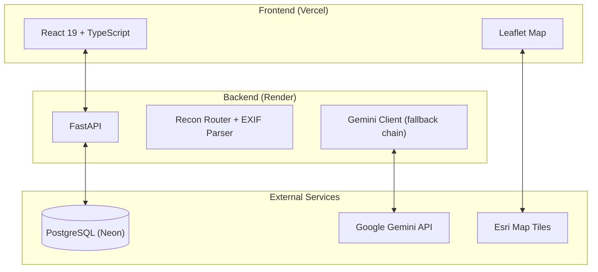

# Tactical Operations Platform (TOP)

[](https://tactical-operations-platform.vercel.app/)


C4ISR-style web dashboard for UAV operators and command posts. Tactical map + AI-powered aerial photo analysis + automated SITREP generation, all in one screen.

---

## What it does

- **Tactical map** — Leaflet with 3 tile layers (Esri dark, satellite, topo). Threat zones rendered as priority-coded circles around targets. Clicking a task in the sidebar flies the camera to its coordinates.
- **Drone recon module** — Upload an aerial photo, Gemini Vision analyzes it: identifies military objects, draws bounding boxes with confidence scores, reads EXIF GPS from the image and plots the location on the map automatically.
- **SITREP generator** — Takes all targets from the map and generates a structured situation report (NATO/AFU format) via Gemini. Markdown preview, raw text editor, copy to clipboard, export as `.txt`.
- **AI fallback chain** — If one Gemini model hits rate limits, the request automatically retries on the next one in the chain (`3.8-flash` → `3.5-flash` → `3.1-flash-lite`).
- **Auth** — Callsign + password, bcrypt hashing, JWT tokens (24h).
- **i18n** — Ukrainian military terminology + English (NATO).
- **4 color themes** — Amber, Emerald, Neutral, Sky.

---

## Architecture



---

## Tech stack

| Layer | What's used |
|---|---|
| Frontend | React 19, TypeScript, Vite, Tailwind v4, React-Leaflet, Lucide, React-Markdown |
| Backend | Python 3.11, FastAPI, SQLAlchemy 2.0, Pydantic v2, PyJWT, Pillow, HTTPX |
| Database | PostgreSQL 15 (Neon) |
| AI | Google Gemini API — multimodal vision + text generation |
| Infra | Docker Compose, Nginx, Vercel, Render, Pytest |

---

## Quick start

### Local dev

**Backend:**
```bash
cd backend
python -m venv venv
venv\Scripts\activate        # Windows
# source venv/bin/activate   # Linux/macOS
pip install -r requirements.txt
python seed.py
uvicorn main:app --reload --port 5000
```

**Frontend:**
```bash
cd frontend
npm install
npm run dev
```

App runs at `http://localhost:5173`, API docs at `http://localhost:5000/docs`.

### Docker

```bash
git clone https://github.com/1NikolayDmitriev1/tactical-operations-platform.git
cd tactical-operations-platform
docker compose up --build
```

---

## Demo credentials

Seeded by `seed.py` with 5 pre-placed targets on the map:

| Callsign | Password |
|---|---|
| `GHOST-7` | `tactical_pass` |

---

## Tests

```bash
cd backend
pytest -v tests/test_api.py
```

---

## License

MIT